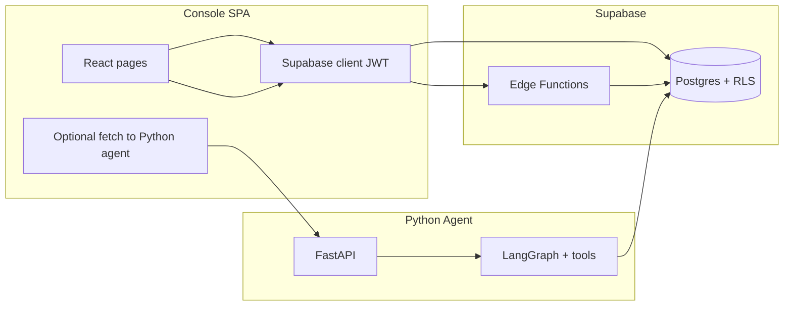

# Edvera Architecture Audit & Pilot Readiness

**Scope:** `console/`, `agent/`, `supabase/`, `scripts/` — excludes the parent-facing frontend in `src/`.  
**Prepared for:** Internal review before school district pilot.  
**Last updated:** March 29, 2026

---

## Table of contents

1. [Executive summary](#1-executive-summary)
2. [Architecture audit — what’s built](#2-architecture-audit--whats-built)
3. [Architecture — how it fits together](#3-architecture--how-it-fits-together)
4. [What looks working](#4-what-looks-working-for-a-pilot--internal-build)
5. [What’s incomplete or fragile](#5-whats-incomplete-or-fragile)
6. [Critical gaps for production](#6-critical-gaps-for-production)
7. [Recommendations before piloting (with solutions)](#7-recommendations-before-piloting-with-solutions)
8. [Suggested implementation priority](#8-suggested-implementation-priority)

---

## 1. Executive summary

The codebase is a **credible vertical slice**: a staff **console** on a **rich Supabase schema**, a **deterministic compliance / risk / funding pipeline** (orchestrated Edge Functions and shared `_shared/` engines), **optional LLM** features at the edge, and a **Python read-only agent** with a clear behavioral spec.

For production and especially **district pilot**, the highest-impact work is **locking down secrets and authorization** (browser-exposed agent keys, `run-all-engines` invoker model), **unifying how briefs and assessments are delivered**, and **defining scheduling + monitoring** for the engine pipeline rather than relying only on manual triggers.

---

## 2. Architecture audit — what’s built

### 2.1 Console (`console/`)

- **Stack:** Vite + React 18 + TypeScript + Tailwind; `@supabase/supabase-js`.
- **Surface area:** Dashboard (metrics, optional agent brief panel), students and detail, compliance list and **case workspace** (tiers, actions, outreach logging, SARB packet flow, hearings, resolutions), funding, action center, **CSV import** (large `csv-processor` engine), reports (including briefs), legal reference, settings, login/security.
- **Patterns:** Route-level lazy loading; `AuthGate` + `ConsoleLayout`; **service modules** for data access (per `console/KNOWN_ISSUES.md`, direct `supabase` in pages/components was migrated; some **hooks** still use Supabase directly).
- **Integrations:**
  - **Edge Functions:** e.g. `run-all-engines`, `generate-insights`, `daily-brief`, `generate-sarb-narrative`.
  - **Optional Python agent:** `services/agent/getAgentBrief.ts` uses `VITE_AGENT_URL` and `VITE_AGENT_API_KEY`.

### 2.2 Agent (`agent/`)

- **Stack:** Python 3.11+, LangGraph, Anthropic Claude, FastAPI, Supabase Python client (service role).
- **API:** `GET /health`; `POST /agent/daily-brief`, `POST /agent/assess-student` with **`X-Api-Key`** vs `API_SECRET_KEY`.
- **Behavior:** Two-node graph (`tools` → `agent`). Specs: `AGENT_SPEC.md`, `TOOL_SPEC.md`; tests under `tests/`.
- **Implementation note:** For **`daily_brief`**, the graph **returns the precomputed brief without calling the LLM** (deterministic path from brief tools). **`assess_student`** still uses the LLM for structured JSON.
- **Data access:** Read-only tools; **service role** in `lib/supabase_client.py` — RLS bypass; district scoping must be enforced in tools.

### 2.3 Supabase (`supabase/`)

- **Postgres:** Extensive migrations — canonical attendance/compliance schema (students, attendance, snapshots, risk signals, compliance cases, interventions, documents, SARB packets, actions, funding projections, briefs, agent logs/runs, RLS hardening, import/write policies, monitoring stages, effectiveness columns, etc.).
- **Edge Functions (Deno), roughly:**
  - **Computation:** `compute-snapshots`, `compute-risk-signals`, `compute-compliance`, `compute-funding`, **`run-all-engines`** (orchestrates snapshots → risk → compliance → actions → funding → effectiveness backfill).
  - **AI / narrative:** `daily-brief`, `generate-insights`, `insight-question` / `insights-answer`, `generate-sarb-narrative`, `note-ai-assist`, `csv-analysis`.
  - **Ingest:** `ingest-school-calendar`, `ingest-bell-schedule`, `detect-board-meetings` (uses **`X-Admin-API-Key`**), `process-document`.
- **Shared logic:** `functions/_shared/` — `snapshot-engine`, `risk-engine`, `compliance-engine`, `action-generator`, etc. Reused by Edge Functions and repo scripts.
- **Config:** `config.toml` includes **hardcoded `project_id`** and **`verify_jwt = false`** for a **subset** of functions (not the full compute stack).

### 2.4 Scripts (`scripts/`)

Developer / demo utilities (not the production runtime):

| Script | Purpose |
|--------|---------|
| `seed_canonical.ts` | Deterministic seed for synthetic “Pacific Unified” district (service role). |
| `simulate-day.ts` | Inserts attendance, runs pure engines locally, writes via Supabase. |
| `generate-actions.ts` | One-off action backfill from compliance cases. |

---

## 3. Architecture — how it fits together

- **Data plane:** Staff use JWT-scoped Supabase with **RLS** on core tables.
- **Computation:** Heavy jobs run in Edge Functions using **service role** inside the function.
- **Dual AI surface:** (1) Supabase Edge (insights, stored briefs, SARB narrative, etc.) and (2) optional **Python agent** (dashboard brief; `assess-student` exists on API but is **not wired in console** in this audit).

---

## 4. What looks working (for a pilot / internal build)

- **End-to-end product shape** in the console: auth, compliance workspace, reports, import, action center, backed by a serious schema and engine layer.
- **Engine design:** Shared pure modules, clear orchestration, deterministic simulation in `simulate-day.ts`.
- **Security patterns in places:** e.g. `detect-board-meetings` checks `ADMIN_API_KEY`; some insight flows forward user JWT for RLS-scoped reads.
- **Documentation:** Agent behavior and tools are unusually thorough (`AGENT_SPEC.md`, `TOOL_SPEC.md`, `KNOWN_ISSUES.md`).

---

## 5. What’s incomplete or fragile

1. **`assess_student`** — Implemented in FastAPI / graph; **not integrated** in `console/src` (only `daily-brief` client pattern exists).
2. **`agent_logs`** — Read policy and logging helpers exist; **operational fit** (retention, PII in summaries) needs validation. Possible JSON serialization nuance: logging may pass stringified JSON into JSONB columns — verify client behavior.
3. **Engine scheduling** — `pg_cron` appears in migrations; **no single, repo-clear story** for “production always runs engines after X.” Console can **`run-all-engines` manually** via `useEngineRunner`.
4. **Split brief systems** — Supabase `daily-brief` + **`briefs` table** vs Python **dashboard brief** — two sources of truth risk.
5. **`config.toml`** — Partial `verify_jwt` overrides; compute/orchestration functions depend on platform defaults and **lack extra role checks** inside handlers (see gaps below).

---

## 6. Critical gaps for production

| Area | Risk |
|------|------|
| **`VITE_AGENT_API_KEY` in the browser** | Extractable from built SPA; callers can abuse the FastAPI surface. |
| **`run-all-engines` + service role** | No in-function authorization pattern like `detect-board-meetings`; any JWT that can invoke may trigger **district-scale recompute**. |
| **Python agent + service role** | Correct for a trusted server, but **every tool must enforce** district / membership; bugs ⇒ cross-tenant read. |
| **Agent API auth** | Static shared `X-Api-Key` — weak for multi-tenant SaaS; limited per-user audit. |
| **FastAPI CORS** | Configured for **localhost** origins; production domains must be set explicitly. |
| **AI / third-party keys** | Anthropic (and some paths reference other providers). Requires budget, rotation, and degradation — some UX already soft-handles insight failures per `KNOWN_ISSUES.md`. |
| **Edge Functions with `verify_jwt = false`** | JWT not enforced at platform layer; must rely on **strong alternate auth**; treat as high review before public exposure. |
| **Committed `project_id`** | Common practice; ensure no secrets adjacent. |
| **Automated verification** | Agent tests exist; CI coverage for agent + Edge TypeScript should be confirmed for your org. |

---

## 7. Recommendations before piloting (with solutions)

### 7.1 Remove privileged keys from the browser

**Problem:** `VITE_AGENT_API_KEY` (and similar) is public in any shipped SPA.

**Solution:**

- Do **not** ship agent secrets in `VITE_*`.
- Add a **Supabase Edge Function** (e.g. `agent-daily-brief`) that: validates the user JWT, checks `staff_memberships` / district scope, then calls the Python agent with a **server-only** secret (or in-sources LLM on the edge if you collapse stacks).
- Console uses `supabase.functions.invoke('agent-daily-brief')` only — **no** shared API key in the client.

### 7.2 Gate and limit `run-all-engines`

**Problem:** Service role inside function; powerful work; inconsistent with `detect-board-meetings` hardening.

**Solution:**

- Inside `run-all-engines`: verify **JWT + role** (e.g. district admin only), **or** require **`X-Admin-API-Key`** / cron secret for invocations.
- Add **rate limiting** (per district or global).
- Prefer **scheduled** primary execution (Supabase cron or external scheduler); keep manual “run” for admins only.

### 7.3 Lock down `verify_jwt = false` Edge Functions

**Problem:** No JWT at edge unless you add your own controls.

**Solution:**

- Per function: either **enable `verify_jwt = true`** and use user-scoped client for RLS, **or** keep JWT off but require **ADMIN_API_KEY**, internal networking, or both.
- Avoid **open CORS + no auth** on anything touching production data.

### 7.4 Python agent: defense in depth

**Problem:** Service role bypasses RLS.

**Solution:**

- Audit **every tool** for district / school membership against the same context the console enforces.
- Add **integration tests** that attempt cross-district IDs and expect failure.
- Minimize PII in `agent_logs` (`inputs_summary` / `output_summary`).

### 7.5 One clear “brief” story

**Problem:** Two brief paths confuse staff and support.

**Solution:**

- Choose **one** canonical brief for pilot (e.g. `briefs` table from edge, or agent-backed after proxying).
- Hide or label the other as non-pilot, or **merge** so one job writes `briefs` and UI reads one source.

### 7.6 Operational runbook: engines + freshness

**Problem:** “Why didn’t the dashboard update?”

**Solution:**

- Document **when** engines run (post-import, nightly, etc.).
- After successful import, **trigger** `run-all-engines` from a **trusted server path** (not arbitrary users).
- Show **“last computed at”** (school/district) on dashboard or reports.

### 7.7 Incident and support readiness

**Solution:**

- Simple **job status** (last run, error) persisted per district or globally for pilot-critical flows (import, engines, briefs).
- Reduces reliance on raw platform log access for first-line support.

### 7.8 Pilot legal / trust (non-code essentials)

**Solution:**

- Short **terms + privacy** text: what is stored, district visibility, retention, and that outputs are **decision support**, not legal advice (aligned with agent spec limits).
- Link from app or provide as PDF for the pilot MOU packet.

### 7.9 Environments and secrets

**Solution:**

- Separate **Supabase project** or strict env split for pilot vs dev.
- **Rotate** keys at pilot kickoff; confirm `.env` is gitignored and CI uses secret stores.

### 7.10 Finish or defer incomplete surfaces

**Solution:**

- **`assess-student`:** either add a **minimal student-detail entry point** or **disable** the route in production until wired — avoid half-built promises during pilot.

---

## 8. Suggested implementation priority

1. **Browser secret removal** (agent proxy) + **`run-all-engines` authorization**
2. **`verify_jwt = false` hardening** (per-function review)
3. **Agent tool cross-tenant tests** (and quick tool audit)
4. **Single brief narrative** + **import → engine automation** + **“last updated”** UX
5. **Legal/support artifacts** for the district

---

## Document usage

- **Download:** Copy this file from the repository path  
  `docs/Edvera_Architecture_Audit_and_Pilot_Readiness.md`
- **Export to PDF:** Open in VS Code / Cursor preview, or use Pandoc, Google Docs import, or any Markdown-to-PDF tool your org uses.

---

*This document merges an architecture audit of `console/`, `agent/`, `supabase/`, and `scripts/` with pilot readiness recommendations. It is not legal advice.*
